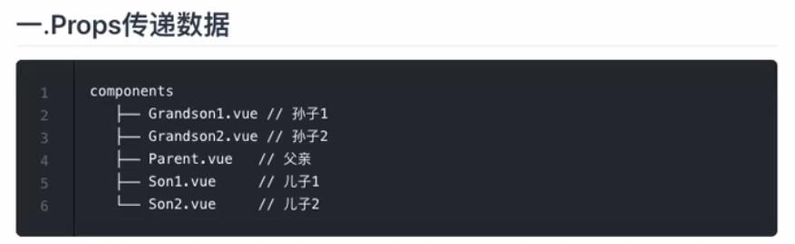

## Vue 组件间通信方式

### 快速原型开发
可以快速识别.vue文件封装组件插件等功能
```
npm install @vue/cli -g
npm install -g @vue/cli-service-global   //不用任何东西可以直接帮我们初始化一个项目
vue serve App.vue

如果安装不了，
配置淘宝镜像npm config set registry https://registry.
```

### 一、Props传递数据
