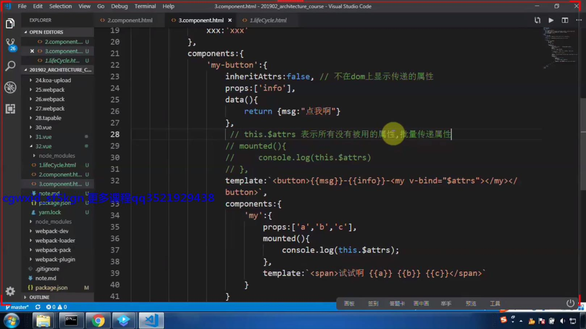
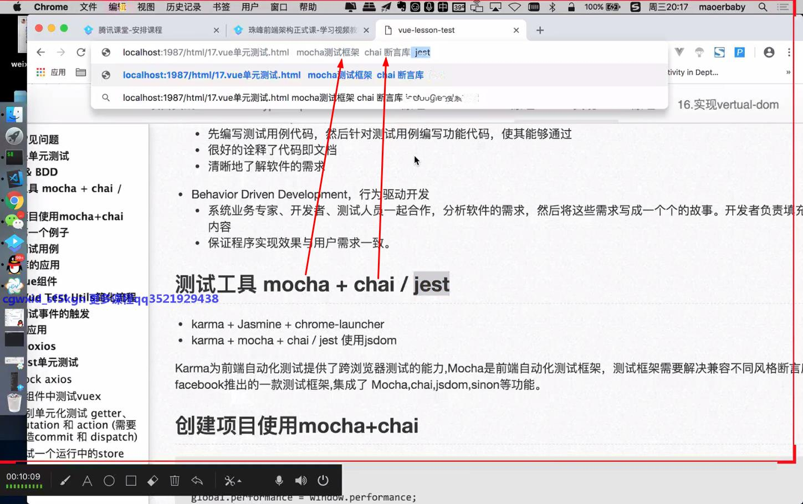

## VUE核心讲解


 - 3.vue的指令


 - 4.vue的表单元素
 


 - 5.vue的自定义指令：directive


 - 6.vue的过滤器：filters
 


 - 7.vue的监听属性：computer与watch区别


 - 8.vue的动画：animate


 - 9.用vue写的搜索出现内容效果


#### vue的应用
 - 响应式的数据变化，什么样的数据可以发生变化
 - vue中的指令14个
 - 自定义指令 自定义过滤器
 - computed watch methods
 - vue动画 在js中如何使用动画 用css如何实现动画


 ### vue的组件应用
 - vue的树组件
 - vue的日历组件
 - 表单组件
 - 扩展表格组件

 ### 组件的应用
 - 组件的生命周期，每个声明周期 做什么内容
 - 组件间的通信 props events parent children ref eventBus vuex
 - render方法 element-ui iview render的方法的使用

 - 10.生命周期


 - 11.组件 component ：复用，方便维护，拆分方便，每个组件间作用域是隔离的，组件间互不干扰，组件间的数据传递，组件就是一个自定义的标签，可以代表一些特定的功能，主要封装  css  html  js   .vue文件
 





 - 12.插槽 solt


 - 13.provide(在根组件中注入数据)&inject(在子组件中消费数据)
 
 
 - 14.ref
 
 
 
 
 - 15.brother
 
 
 - 16.input
 
 
 - 17.vuecli安装
  
  - vuecli应用，iview应用，组件的应用讲解
  
  
- npm install -g @vue/cli ??和图片不一致  
 
 
 
 
 
 
- 之后 进入项目，yarn serve
- 最后会给访问路径，访问即可
 
 assets  -- 图片资源，公共样式
 components  -- 放组件的
 App.vue -- 里面有模板，脚本和样式
 main.js -- 渲染模块
 
- 自己要建一个vue.config.js文件，来自己配置webpack 
 
 
 

- yarn add axios 安装axios

-  打包 npm run build
 
   
 - vue的日期插件，手写了一个类似的日历插件，里面有些如何获取四十二天后的方法  
 
##### 基于vue-cli编写组件
 - 1.小球的滚动组件 
 ```
   //思路
   // 组件的id问题  _uid
   //属性问题  校验 -> 计算属性
   //双向通信 props+emit  /v-model  /.sync
   //数据的绑定问题  $refs 拿到组件内部的方法  来调用组件中的方法
   主要代码在vue-router-apply的components里的ScorllBall
 ```
 - 部分老师截图
  
  
  
 - 2. 安装vue-router
   - yarn add vue-router
 ### vue-router  部分配置截图
 
   
   
   
   
 
 ###### 老师课件同步代码
 - 1.先安装 yarn add vue-router
   - 哈希/history
     - 哈希，如https://www.baidu.com/#a，#a就为哈希值，一有哈希值访问路径就会发生变化
     - history:h5的api“histroy.pushState({},null,'/a'),如果用vuecli脚手架的时候，如果这样写路径不存在，它会默认定位到首页
      
 
   - 创建views，放页面
   - 创建router文件，放路由的配置
   - 在main.js中引入
   - 在router文件夹中创建 routes.js文件，存放映射表，也就是存放所有路由的数组，在存放到 router/index.js 
   - 安装一个bootstrap@3样式库，为了快速写样式        
- 小知识点
   - 1.router-link里的属性
     - :to="{name:'home'}"和:to="{path:'/home'}"，他们基本上是差不多的，但用name这个命名路由的时候是不能被渲染的，所以要用path
     - tag="span":router-link里面默认显示a标签，这个属性是改为你想要的标签  
   - 2.路由中children中的path是可以写成'/user/add'：这是从根里有开始找。但是不能写成'/add'：这就是直接找根路由的add，所以可以直接要写成'add'     
   - 3.当组件切换时
       - 会触发离开的路由的钩子函数: beforeRouteLeave(to,from,next) 从哪来，到哪去，往下走的三个参数
       - 渲染完成后，会进入到新的页面里，组件内部，会触发一个方法：beforeRouteEnter(to,from,next) 从哪来，到哪去，往下走的三个参数，  此方法中不能拿到this，因为还没进来呢
       - 当属性变化时，并没有重新加载组件beforeRouteUpdate(to,from,next) 从哪来，到哪去，往下走的三个参数，
       - beforeEnter这个在routes.js里面配置的，会先走这个，在走小组件里的beforeRouteEnter
       - 在main.js里面配置beforeEach（全局的）这是个全局属性这个是最先走的，在会走beforeEnter（局部的），再走beforeRouteEnter（组件的）
       - 当前路由解析完成后会跳转的钩子beforeResolve（组件解析的）,也是在main.js里配置，这是beforeRouteEnter之后走的
       - 全部都走完的钩子afterEach（当前进入完毕），这是最后走的
      - 老师写的 当组件切换时
        
        
       
```javascript
           //当组件都渲染完成之后，才会拿到这个东西，会调用当前beforeRouteEnter
              next(vm=>{
                  //获取实例
                  console.log(vm)
              });
              // main.js里面配置
              router.beforeEach((to,form,next)=>{
                  console.log('全部');
                  next()
              });
              // main.js里面配置
              router.beforeResolve((to,form,next)=>{
                  console.log('解析');
                  next()
              })
```

       
   - 4.$router存的方法，$route存的属性  
      - this.$router.push('/user/list');  跳转页面
      
      - this.$route.query 查询字符串
        - this.$route.query.id 获取id（这个获取id是在<router-link to="/user/detail?id=1">这样写的）//问号传递参数
        - this.$route.params.id 获取id(这个获取id是在router-link里面<router-link to="/user/detail/2">这样写的) //通过路由的路径传递参数
      
               
 -  使用 NPM 安装Vue并创建项目https://www.cnblogs.com/trnanks/p/10987248.html 
 
 
 ### 单元测试
 
- mocha-chai用法
  
  
  
  
  
  
  
  
  
  
  
  
- https://github.com/axios/moxios
##### 前端常见问题
- 修改js模块功能，其他模块也受影响，很难快速定位bug
- 多人开发代码越来越难以维护，不方便迭代，代码无法重构

###### 什么是单元测试
- 单元测试就是测试最小单元（一个方法，一个组件）

###  与老师同步的单元测试视频代码

- 1.先安装一个node在9版本以上的node
- 如果觉得下载速度慢的话，可以先安装淘宝镜像
  - npm install -g cnpm --registry=https://registry.npm.taobao.org

- 2.npm install yarn  要安装yarn
- 3.npm install -g @vue/cli  要安装vue-cli的3版本项目
- 4.vue create mocha-vue   创建一个叫mocha-vue的项目
- 5. 项目配置选项，如图
   
   
   
   
   
   
   
   
- jest用法
  
 
 
#### macha测试插件的用法
- https://www.chaijs.com/ 官网
- https://mochajs.cn/
 
- 小知识
 - 前端测试的时候 
   - 1）去自测，不会保留测试代码,测试代码会混在源码中，console.log也算测试用例
   - 2）想要测试哪个js文件，就在在tests->unit下创建相同的文件，但后缀名为.spec.js/.test.js
   - 运行是yarn run test:unit
```
//写代码的时候  macha（工具）+chai(断言库)

//我要测试的方法
//一个用例


//常见的关系   相等 大于/小于  包含和不包含
//describe这是套架
describe('专门测试parser',()=>{
    it('我要测试这个parser是否靠谱',()=>{
        //所有的断言都有to.be  xxx  ,  equal 为 ===
        //deep.equal 就表示俩个对象是否完全相等（引用空间无所谓）
        expect(parser('name=zfpx')).to.be.deep.equal({name:'zfpx'})
    });
})

describe('专门测试stringify',()=>{
    it('我要测试stringify靠不靠谱',()=>{
        expect(stringify({name:'zfpx'})).to.be.equal('name=zfpx')
    })
})
it('相等关系',()=>{
        expect(1+1).to.be.equal(2)//是否相等
        expect([1,2,3]).to.be.lengthOf(3)//当前数组里有三项
        expect(true).to.be.true;//判断布尔类型，是否正确
    })
    it('包含',()=>{
        expect('zfpx').to.be.contain('zf');//是否包含
        expect('zfpx').to.be.match(/zf/);//正则匹配是否包含
    })
    it('大于/小于',()=>{
        expect(5).to.be.gt(3);//gt也可以写成greaterThan
        expect(3).to.be.lt(5);//lt也可以写成lessThan
        expect(3).to.be.not.gt(10)
    })
``` 

  

 
 
# 语法糖 
 - v-model=:value +input
 - :xxx.sync="xxx" = :xxx =this.$emit('update:xxx')
 
# 面试题 
 
### 1.vue组件数据传递 
 
- 父子组件通信
  父->子props，子->父 $on、$emit （发布订阅）
 获取父子组件实例的方式 $parent、$children
- Ref 获取实例的方式调用组件的属性或者方法
- 在父组件中提供数据子组件进行消费，Provide、inject 官方不推荐使用，但是写组件库时很常用

- 兄弟组件通信
- Event Bus 实现跨组件通信 Vue.prototype.$bus = new Vue
  - eventBus 定义到了全局上，如果一个人发布一个时间，如果有同名的会全部触发，在大型项目有重名的，不管是儿子还是父亲就会全部触发，所以一般在小型项目上使用
- Vuex

- 跨级组件通信
  - Vuex
  - $attrs、$listeners
  ```
        <!-- $attrs 表示属性的集合-->
        <!-- $listeners  表示的是方法的集合-->
        <!-- v-bind  属性-->
        <!-- v-on  方法-->
        <!--这个方法就可以代替props-->
        <Grandson2 v-bind="$attrs" v-on="$listeners"></Grandson2>
  ```
  - Provide、inject
 
 #### 2.defer & async/preload & prefetch
 - defer和async在网络读取的过程中都是不解析
 - defer是有顺序依赖的，async只要脚本加载完后就会执行
 - preload可以对当前页面所需的脚本、样式等资源进行预加载
 - prefetch加载的资源一般不是用于当前页面的，是未来很可能用到的这样的一些资源 
```
  defer async的区别
- 同步：都是异步加载js的
- 异步
  - defer虽然是异步，但是是有序加载js的
  - async虽然是异步，但是是无序加载js的，谁加载的快，谁先执行

## preload prefetch的区别

- preload预加载，预加载这些资源，在去解析html，相当于也是异步的
- prefetch 浏览器空闲的时候预抓取，在点击的时候就不需要加载了，但是它太多可能浏览器会崩溃 
 
- webpack懒加载，不去切换页面就不会加载
 
 ```

 
 
 ### _uid
 - Vue 组件的_uid来唯一标识（每个Vue实例都会有一个递增的id，可以通过this._uid获取
 
 
 
 
 
 
 
 
 
 
 
 
 
 
 
 
 
 
 
 
 
 
 
 
 
 
 
 
 
 
 
 